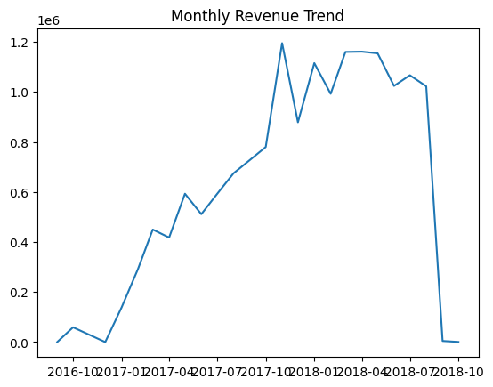
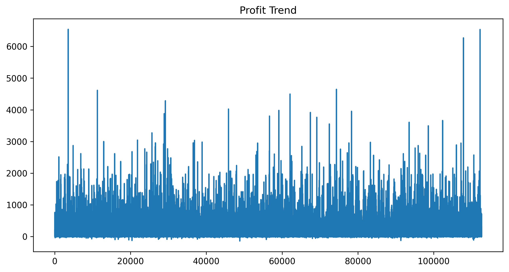
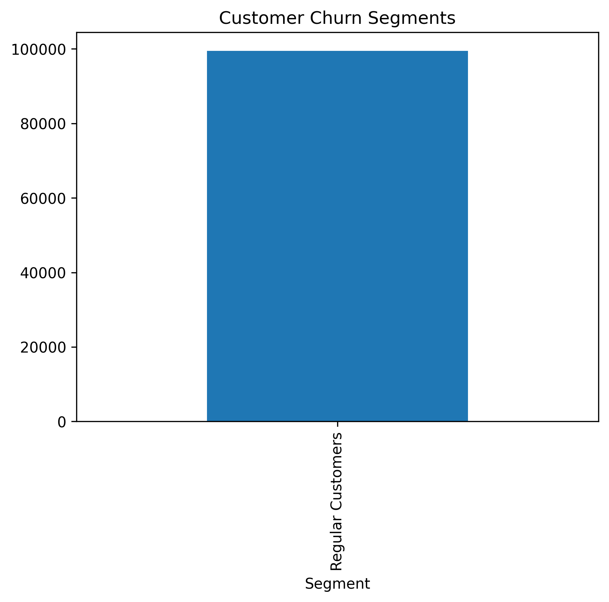
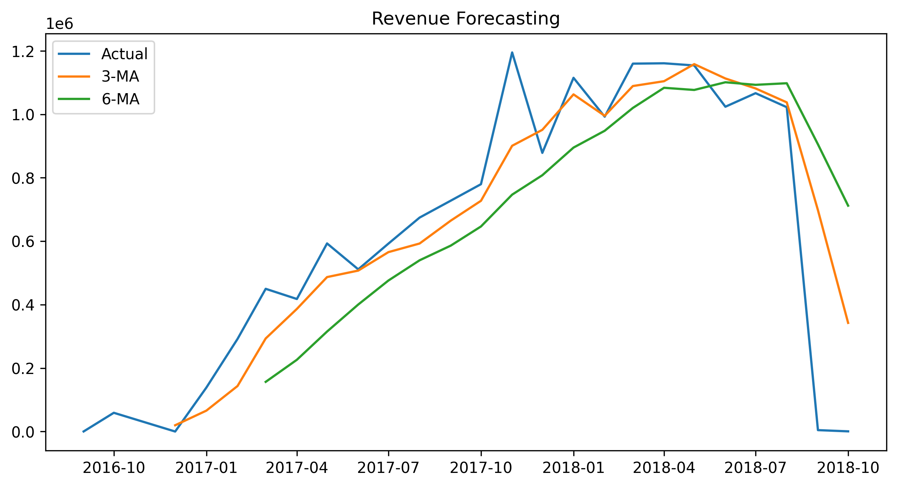

# 📊 Olist E-Commerce Financial Analytics Project

## 📌 Project Overview
This project analyzes the Brazilian e-commerce dataset (Olist) to derive insights on revenue, profitability, customer churn, and forecasting.

---

## 🎯 Objectives
- Revenue trend analysis
- Profitability analysis
- Customer churn segmentation (RFM)
- Sales forecasting

---

## 🛠️ Tools
- Python
- Pandas
- Matplotlib
- Seaborn

---

## 📈 Visualizations

### Revenue Trend

### Profitability

### Customer Churn

### Forecasting

